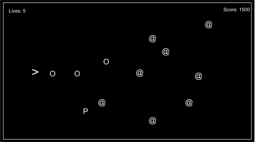
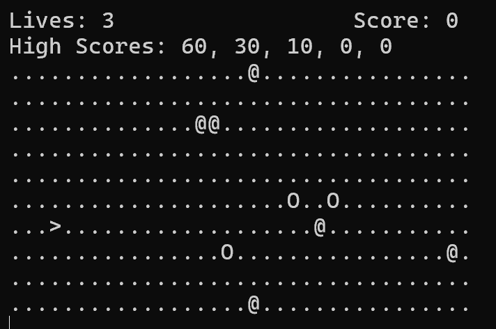
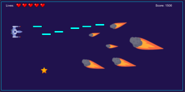
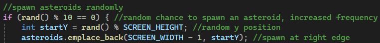
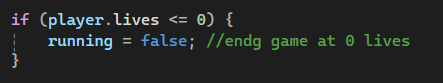
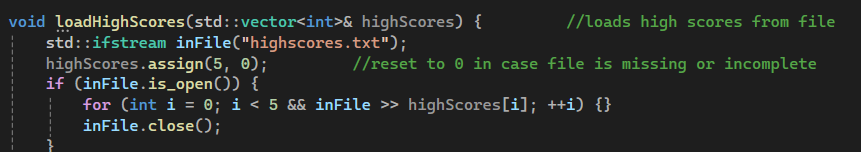
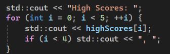
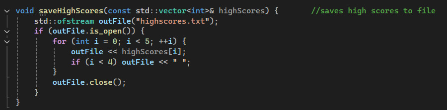
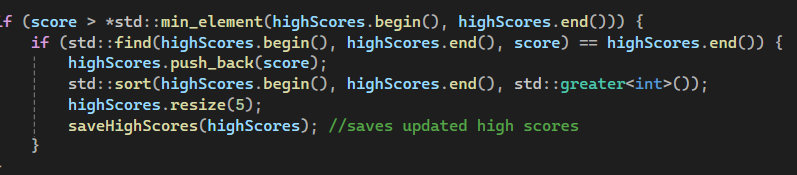
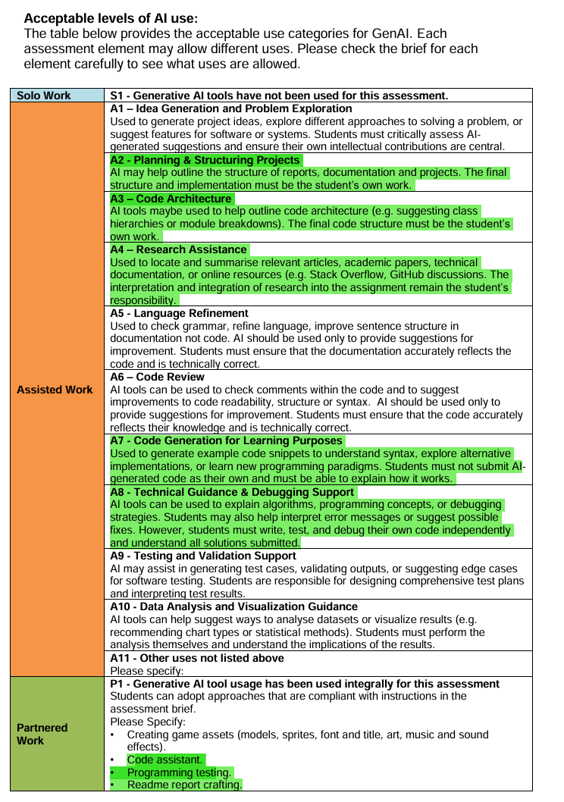

*3019 Report*  
*Asteroid Astronaut* 

*Gameplay*   
*The game asteroid astronaut runs in the terminal and uses ASCII formatting to make up the graphics. The game is influenced by classic asteroid shooter games and follows early mobile/browser flash game principles remaining simple but difficult. The player must move the spaceship ( \> ) around the stage destroying as many asteroids ( @ ) while ensuring none of them hit the player otherwise they will lose a life, the game starts off simple but becomes overwhelming after some time. The goal of the game is to obtain the highest score possible with the game tracking and ordering the highest 5 scores while displaying them at all times.* 

*Dependencies*  
*Asteroid Astronaut utilises standard C++ libraries* 

* *\<iostream\>  \- console input/output and rendering*   
* *\<vector\> \-managing collections*  
* *\<cctype\> \-case insensitive input handling*   
* *\<conio.h\>*  
* *\<windows.h\>*  
* *\<algorithm\> \-for vector operations*   
* *\<iomanip\> \-text alignment*   
* *\<fstream\> \-reading/writing highscores* 

*AI implementation*   
*AI (Grok) was used as an assistive tool throughout development. AI was used to provide code assistance, particularly for debugging one scenario where AI accelerated the debugging process by trying to get the highscores system working. The implementation of this system took a while and I made plenty of simple mistakes doing this ranging from file loading errors to simple display errors using ‘\<iomanip\>’. Using AI, I was able to find these errors much quicker and get the Highscore system implemented at a much faster rate.*

*Beyond debugging I used AI as a mentor for C++ and OOP practices and used it when I was ever stuck or unsure. I often shared code sections for review and received suggestions; however, all prompts were never applied blindly and I ensured any recommendations aligned with my original design goals and I understood how I was applying any snippets of code.*

*In summary:* 

* *Ai accelerated debugging*   
* *Deepened C++ understanding*   
* *I remained the lead developer and didn't follow AI blindly*   
* *Final implementation is my own with AI serving as a tool* 

*Testing* 

| *Test Cases*  | *Description*  | *Expected*  | *Actual*  | *Pass?* |
| :---- | :---- | :---- | :---- | :---- |
| *Movement*  | *Pressing WASD*  | *Player moves Up (W) Down (S) Left (A)  Right (D)* | *Player moves Up (W) Down (S) Left (A)  Right (D)* | *Yes*  |
| *Shooting*  | *Pressing Space*  | *A bullet is created at x \+ 1 of the player and travels right*  | *A bullet is created at x \+ 1 of the player and travels right*  | *Yes*  |
| *Boundary (player)* | *Move player to x=0 and press A*  | *Player stays at x=0* | *Player stays at x=0* | *Yes*  |
| *Boundary  (asteroid, bullet)* | *Let bullet and asteroid leave the screen*  | *Bullet or asteroid erased*  | *Bullet or asteroid erased* | *Yes*  |
| *Asteroid hit player*  | *Let asteroid hit player*  | *Asteroid destroyed and life \-1*  | *Asteroid destroyed and life \-1*  | *Yes*  |
| *Close game*  | *Press Q*  | *Game stops running*  | *Game stops running*  | *Yes*  |
| *Bullet hit asteroid*  | *Press space and make a bullet hit asteroid*  | *Both destroyed and \+10 score*  | *In some cases bullet passes through asteroid, but doesn’t occur too often*   | *No*  |
| *High score save/load*  | *End with score of 30* | *highscore.txt displays with  30 0 0 0 0  When run game high score reads 30* | *highscore.txt displays with  30 0 0 0 0  When run game high score reads 30* | *Yes*  |

*Diagrams/screenshots* 

*Initial ASCII diagram when generating the idea* 

[

*Key*

* *\> \- Spaceship (player)*  
* *O \- Bullets (shot by player)*  
* *P \- PowerUp*  
* *@ \- Asteroids*   
* *. \- Part of stage*

*Screenshot of the game in its current state*

[

*Vision for game* 

[

*Game mechanics and implementation*  

- *Movement: player movement is controlled with standard WASD controls where each input updates player’s x/y position by 1(1.0f) and limited to constraints of the map* 

- *Shooting: pressing SpaceBar creates a bullet in front of the player that moves right by x \+= 1, the player can only do this after the 500ms cooldown has elapsed*

- *Asteroid spawning/movement: every frame there’s a 10% chance of an asteroid spawning at the right edge and moves left towards the player*

 [

- *Collisions:nested iterator loop checks collision match*   
  * *Bullet:asteroid collisions \= erase both and add 10 score*   
  * *Player:asteroid \= minus 1 life and erase asteroid* 

- *Lives: levels decrease on asteroid collision but when lives reach 0 the game ends*

 [

- *Highscores:*   
  * *Reads highscores from ‘highscores.txt’ at the start of the game and loads them onto display for player to view* 

[

[

  * *Saves new high scores to ‘highscores.txt’ whenever player beats their previous 5 highest scores*

[

[

*The prototype is a single file C++ console app without C primitives. The game loop runs at 6.67 FPS. (Sleep(150)  to reduce flashing from cls).*

***Evaluation***   
*All in all Asteroid Astronaut, is an interactive game that tests player’s reactions and creates a small challenge that players can spend some time on to test their skills. The game is intended for short term use remaining simple and easy to understand by implementing widely understood controls (WASD) and mechanics (cooldowns, highscores) but not be too hard to put down to avoid addictive design.*   
*Despite the deliverable fitting part of my vision there’s a lot I wish was implemented. The game does have a few bugs, nothing too groundbreaking but It would be better if i could’ve ironed these out before submission. Another is the graphics, implementation of SDL for Asteroid Astronaut would really enhance the submission and would make the game a lot more immersive, unfortunately due to poor time management i wasn’t able to get this implemented.*   
*In conclusion I believe the game is a solid prototype that offers some short term enjoyment for players and even though it didn't meet my true vision the game still has something to offer.* 

[
[
